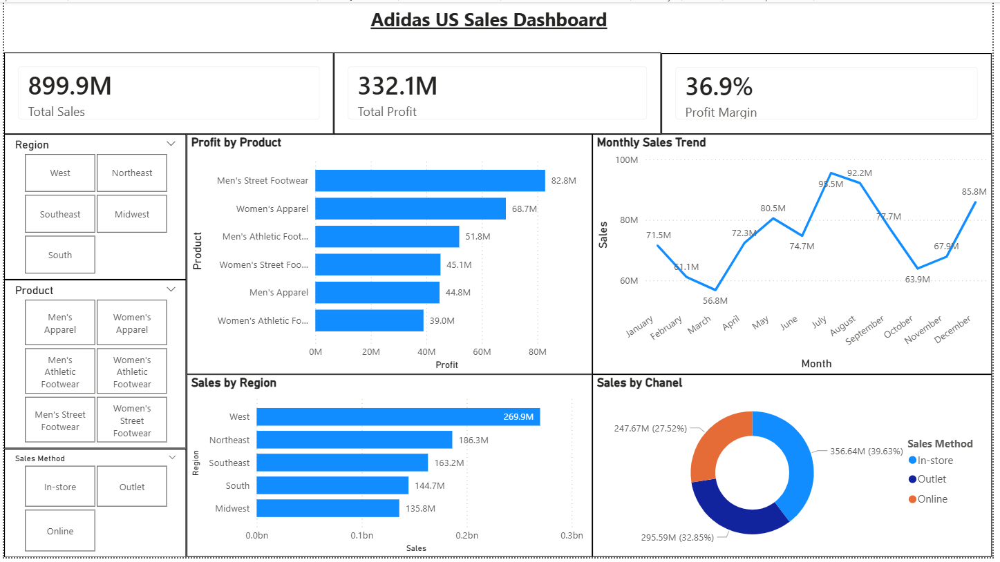

# Adidas US Sales Dashboard (Power BI)

# Project Overview
This project presents an interactive Power BI dashboard analyzing Adidas US sales performance. It provides insights into total sales, profit, profit margin, product performance, regional trends, and sales channel contribution.

# Tools & Technologies
- Power BI
- Data Modeling
- DAX
- Data Visualization

# Key Metrics
- Total Sales: $899.9M
- Total Profit: $332.1M
- Profit Margin: 36.9%

# Key Insights
- West region generated the highest sales ($269.9M)
- Men's Street Footwear is the most profitable product
- In-store sales contribute the largest share (39%)
- Sales peak during July–August and drop in October before recovering

# Dashboard Features
- Interactive slicers (Region, Product, Sales Method)
- Profit by Product analysis
- Monthly Sales Trend visualization
- Regional Sales comparison
- Sales by Channel breakdown

# Files Included
- adidas_sales_dashboard.pbix
- adidas_dashboard.png
- adidas_us_sales_dataset.xlsx

# Dashboard Preview

# Conclusion
This dashboard helps stakeholders quickly identify trends and make data-driven decisions across products, regions, and sales channels.
